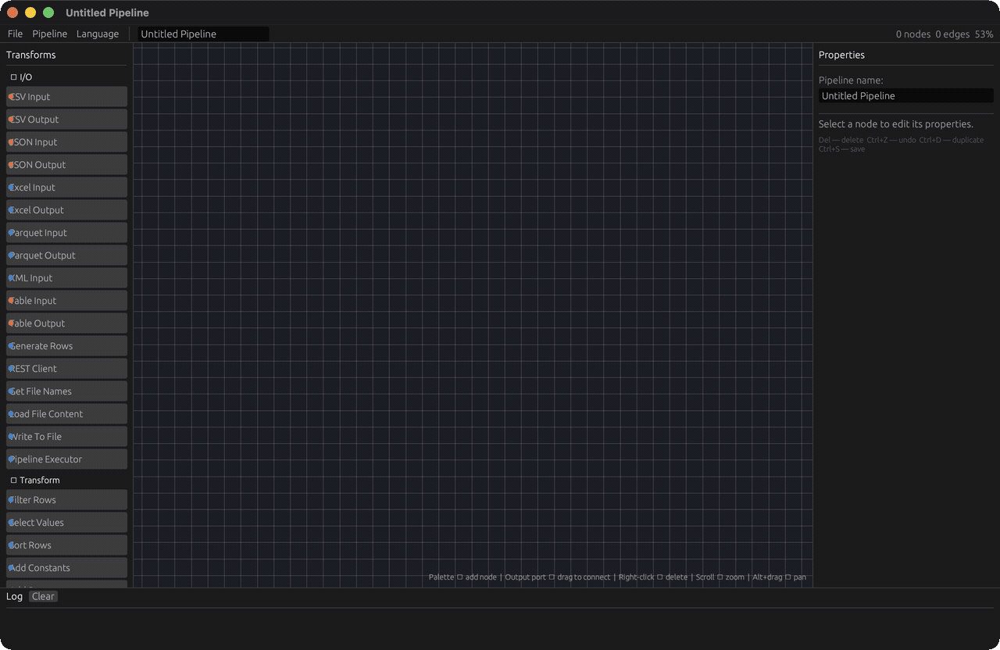
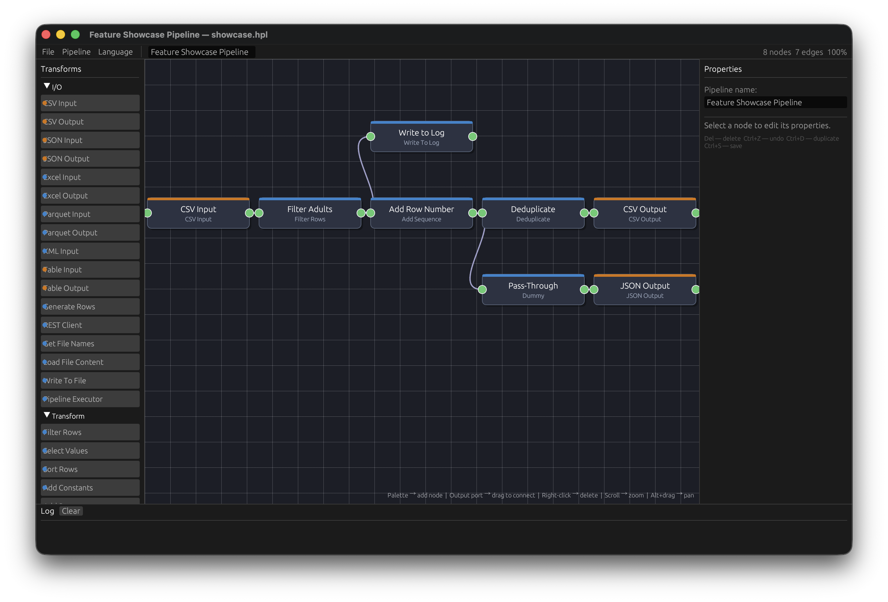
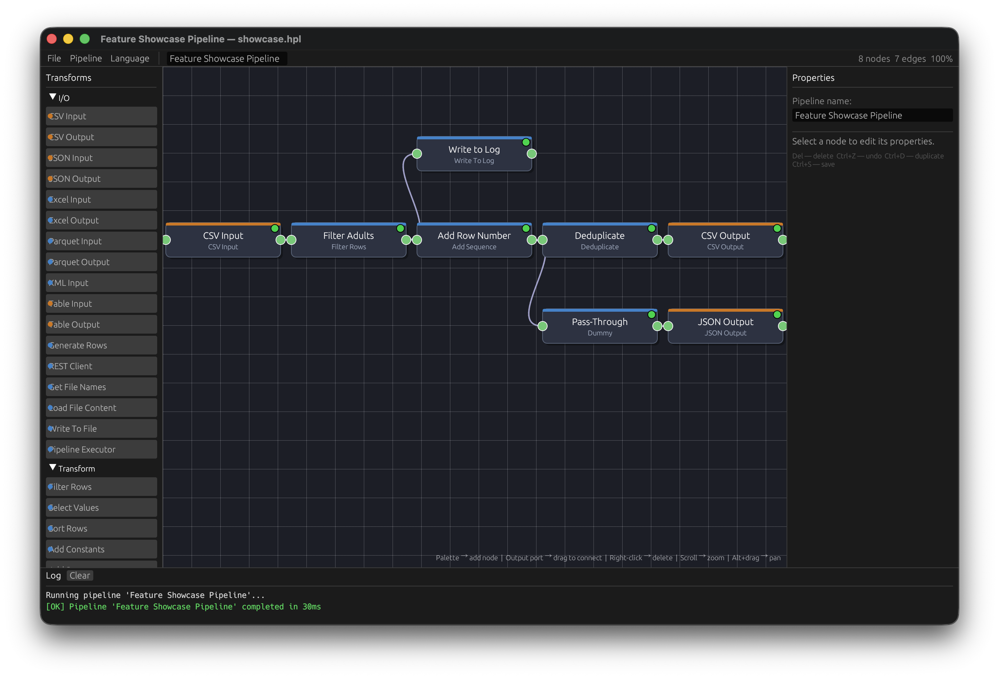
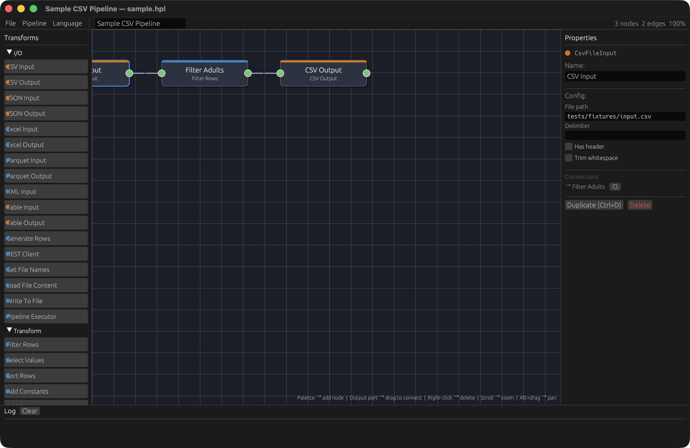
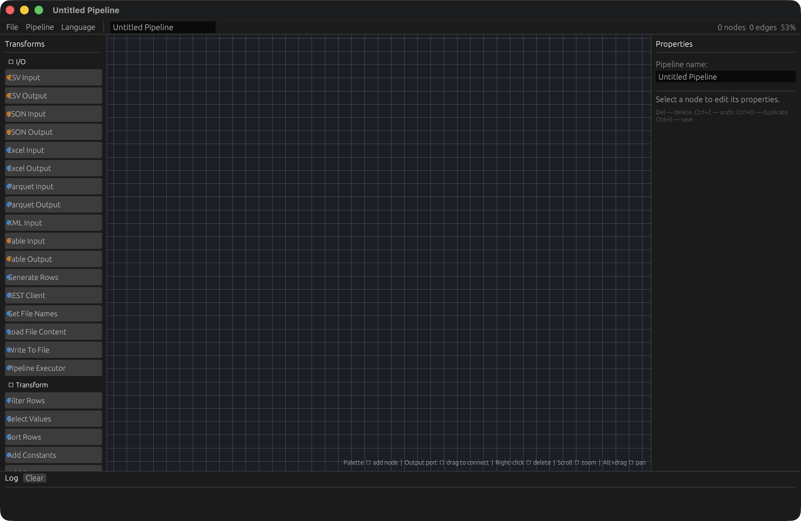
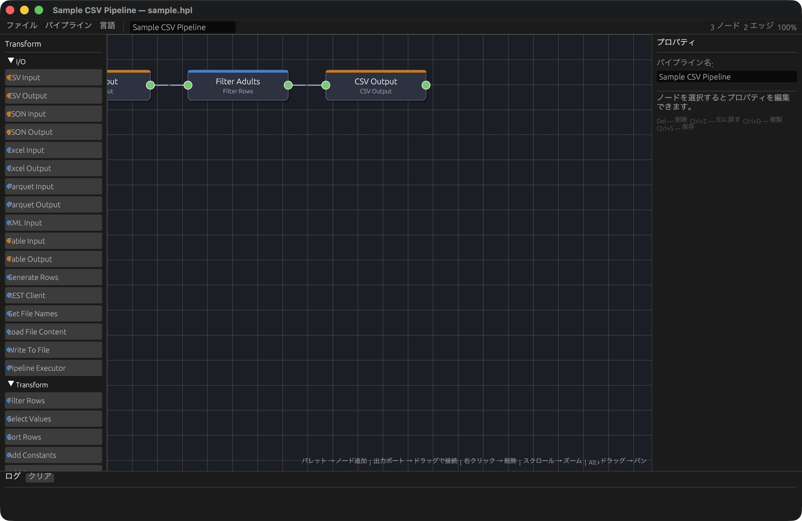
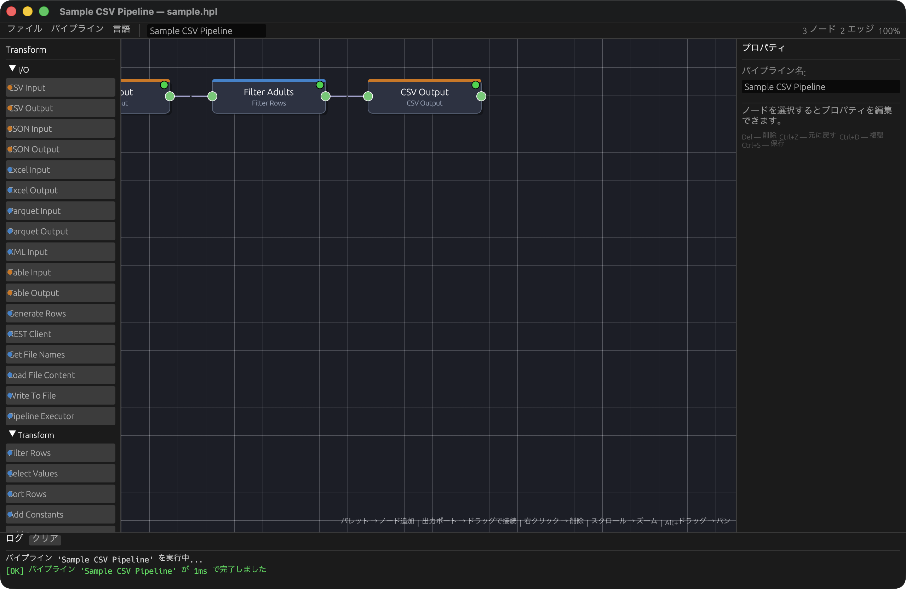

# Ajisai（绣球花）

兼容 Apache Hop 的超轻量、极速 ETL 引擎，使用 Rust 重新构建。

> 保留 Apache Hop 强大的数据转换能力——无需 JVM，以单一二进制文件运行。

[English](README.md) | [日本語](README_ja.md) | 中文

---



| 分支管道 | 执行结果 | 属性面板 |
|:---:|:---:|:---:|
|  |  |  |

| 启动界面 | 日语界面 | 执行后 |
|:---:|:---:|:---:|
|  |  |  |

---

## 为什么选择 Ajisai？

### 现有 ETL 工具的痛点

| 工具 | 痛点 |
|---|---|
| Apache Hop / Talend / Pentaho | 依赖 JVM。启动需要数秒，仅启动就消耗数百 MB 内存 |
| Apache Spark / Flink | 专为 PB 级数据设计，对数十 GB 以下的批处理任务严重过剩 |
| dbt | 仅支持 SQL 转换，不擅长文件 I/O 和复杂行级逻辑 |
| Airbyte / Fivetran | 以连接器为中心的 EL(T)，难以表达转换逻辑 |
| Python (pandas/Polars) | 灵活，但缺乏面向非工程师的 GUI 和可视化管道设计器 |

### Ajisai 的不同之处

- **单一二进制** — 复制 `ajisai-cli` 即可运行，零运行时依赖
- **即时启动** — 无需 JVM 预热，适合 cron 任务、CI 和 AWS Lambda
- **低内存占用** — 以数十 MB 内存处理数百万行数据
- **GUI + CLI** — 可视化设计管道，通过命令行执行
- **复用 Apache Hop 资产** — 直接加载现有 `.hpl` 文件，无需任何修改

---

## 与其他工具的对比

| | **Ajisai** | Apache Hop | Pentaho PDI | Apache Spark | dbt | Polars (Python) |
|---|---|---|---|---|---|---|
| **运行环境** | Rust 原生二进制 | JVM | JVM | JVM / 集群 | Python + DB 适配器 | Python |
| **安装方式** | 单一二进制 | JVM + 500 MB+ | JVM + 500 MB+ | 集群搭建 | pip + DB 连接 | pip |
| **启动时间** | **< 10 ms** | 3–10 秒 | 3–10 秒 | 30 秒+ | 数秒 | ~1 秒 |
| **内存占用** | **~10 MB+** | 256 MB+ | 256 MB+ | GB+ | 依赖数据库 | 数十 MB+ |
| **可视化 GUI** | ○ | ○ | ○ | × | × | × |
| **CLI 批处理** | ○ | ○ | ○ | ○ | ○ | 脚本 |
| **Apache Hop 兼容** | 读取 `.hpl` | 原生支持 | △ 共同祖先 | × | × | × |
| **文件 I/O** | CSV / JSON / Excel / Parquet / XML / REST API | 多种 | 多种 | HDFS / S3 等 | 仅 DB | CSV / Parquet 等 |
| **规模目标** | 最多约 1 亿行 | 最多约 1000 万行 | 最多约 1000 万行 | 数十亿行+ | 依赖数据库 | 最多约 1 亿行 |
| **Windows 支持** | ○ | ○ | ○ | △ | ○ | ○ |
| **无需集群** | ○ | ○ | ○ | × | ○ | ○ |
| **许可证** | MIT / Apache-2.0 | Apache-2.0 | Apache-2.0 | Apache-2.0 | Apache-2.0 | MIT |

### Ajisai 的优势场景

- **CI/CD 内嵌 ETL** — 在 GitHub Actions 或 GitLab CI 中无需额外依赖即可运行
- **边缘 / 嵌入式环境** — IoT 设备和内存受限系统的数据转换
- **从 Apache Hop 迁移** — 无需修改 `.hpl` 文件，直接切换到高速执行引擎
- **微服务 ETL** — 最小化 Docker 镜像，无需 JVM 层
- **定时批处理** — cron 友好；每次调用无 JVM 预热开销

---

## 特性

- **兼容 Apache Hop** — 可直接读取 `.hpl` 管道文件
- **高速低内存** — Rust 原生二进制；tokio 异步执行，rayon CPU 并行处理
- **命令行 / 图形界面两用** — CLI 工具与 Electron + React 可视化管道编辑器（VS Code 风格）
- **跨平台** — Windows / macOS / Linux
- **多语言** — 日语 / 英语（UI 和 CLI 均支持）

---

## 安装

```bash
git clone <repo>
cd ajisai
cargo build --release
```

二进制文件生成于 `target/release/ajisai-cli`。

---

## 快速开始

### 执行管道（.hpl）

定义数据读取、处理和写入等转换步骤的文件。

```bash
ajisai-cli run -p path/to/pipeline.hpl
```

### 执行工作流（.hwf）

定义编排逻辑的文件：控制管道执行顺序、文件操作和错误处理。

```bash
ajisai-cli run-workflow -p path/to/workflow.hwf
```

### 验证管道（不执行）

```bash
ajisai-cli validate -p path/to/pipeline.hpl
```

### 列出可用的 Transform

```bash
ajisai-cli list-transforms
```

### 传递环境变量

```bash
ajisai-cli run -p pipeline.hpl -e INPUT_DIR=/data -e OUTPUT_DIR=/output
```

在管道文件中通过 `${INPUT_DIR}` 引用。

---

## 支持的 Transform（53 个）

### I/O

| Transform | 说明 |
|---|---|
| `CsvFileInput` | 读取 CSV 文件 |
| `CsvFileOutput` | 写入 CSV 文件 |
| `JsonFileInput` | 读取 JSON 文件（数组或 JSONL 格式）|
| `JsonFileOutput` | 写入 JSON 文件（数组或 JSONL 格式）|
| `JsonFieldInput` | 解析 JSON 字符串字段，展开为独立字段 |
| `JsonFieldOutput` | 将指定字段序列化为 JSON 字符串字段 |
| `ExcelFileInput` | 读取 Excel 文件（.xlsx）|
| `ExcelFileOutput` | 写入 Excel 文件（.xlsx）|
| `ParquetFileInput` | 读取 Parquet 文件 |
| `ParquetFileOutput` | 写入 Parquet 文件 |
| `XmlFileInput` | 读取 XML 文件 |
| `TableInput` | 通过 SQL 读取数据库表（SQLite / PostgreSQL / MySQL）|
| `TableOutput` | 向数据库表写入数据（Insert / Upsert / Overwrite）|
| `GenerateRows` | 生成内联数据行 |
| `RestClient` | 执行 HTTP GET / POST / PUT / DELETE |
| `GetFileNames` | 扫描目录，将文件元数据作为行输出 |
| `LoadFileContent` | 将文件内容读入字段 |
| `WriteToFile` | 将字段值写入文件 |
| `PipelineExecutor` | 执行 .hpl 子管道 |

### 转换

| Transform | 说明 |
|---|---|
| `FilterRows` | 按条件表达式过滤行 |
| `SelectValues` | 字段选择、重命名及类型转换 |
| `SortRows` | 多字段排序（rayon 并行排序）|
| `AddConstants` | 为每行追加常量字段 |
| `AddSequence` | 自增序号字段 |
| `CalculatorStep` | 字段计算：四则运算、字符串操作、类型转换 |
| `Deduplicate` | 去除重复行（全字段或指定键）|
| `IfNull` | 替换 NULL 值为默认值 |
| `StringOperations` | trim、大小写转换、pad、substring |
| `ReplaceInString` | 字符串搜索替换 |
| `ConcatFields` | 用分隔符将多个字段拼接为新字段 |
| `SplitFieldToRows` | 将一个分隔字段展开为多行 |
| `AnalyticQuery` | 窗口函数（ROW_NUMBER, RANK, LAG/LEAD，分区内 SUM/AVG/MIN/MAX）|
| `MemoryGroupBy` | 分组聚合（sum / avg / min / max / count）|
| `AppendStreams` | 合并多个输入流 |
| `RowNormaliser` | 宽表转长表 |
| `RowDenormaliser` | 长表转宽表 |
| `WriteToLog` | 按指定级别记录行日志 |
| `CloneRow` | 将每行复制 N 次 |
| `FieldSplitter` | 按分隔符将字段拆分为多列 |
| `UniqueRows` | 按键保留第一行 |
| `NumberRange` | 将数值分类到区间 |
| `ValueMapper` | 通过查找表映射字段值 |
| `ExecuteSQL` | 执行一次或每行执行 SQL |
| `Dummy` | 直通（无操作）|
| `Abort` | 按条件终止管道 |
| `RegexEval` | 提取正则表达式捕获组 |
| `ScriptStep` | 对每行执行 Rhai 脚本 |

### 连接 / 查找

| Transform | 说明 |
|---|---|
| `MergeJoin` | 两个有序流的排序归并连接（Inner / Left / Right / Full）|
| `StreamLookup` | 内存哈希连接（维度查找）|
| `DatabaseLookup` | 参数化 SQL 数据库查找 |

### 变量 / 流程控制

| Transform | 说明 |
|---|---|
| `SetVariable` | 设置管道变量 |
| `GetVariable` | 将管道变量读入字段 |
| `SwitchCase` | 按值将行路由到不同输出 |

---

## 管道文件（.hpl）示例

```xml
<?xml version="1.0" encoding="UTF-8"?>
<pipeline>
  <name>My Pipeline</name>
  <transform>
    <name>CSV Input</name>
    <type>CSVFileInput</type>
    <filename>${INPUT_FILE}</filename>
    <separator>,</separator>
    <header>Y</header>
  </transform>
  <transform>
    <name>Filter Adults</name>
    <type>FilterRows</type>
  </transform>
  <transform>
    <name>CSV Output</name>
    <type>CSVFileOutput</type>
    <filename>${OUTPUT_FILE}</filename>
    <separator>,</separator>
    <header>Y</header>
  </transform>
  <order>
    <hop>
      <from>CSV Input</from>
      <to>Filter Adults</to>
      <enabled>Y</enabled>
    </hop>
    <hop>
      <from>Filter Adults</from>
      <to>CSV Output</to>
      <enabled>Y</enabled>
    </hop>
  </order>
</pipeline>
```

可直接加载使用 Apache Hop 创建的 `.hpl` 文件。

---

## 架构

```
ajisai/
├── crates/
│   ├── core/          Row / RowSchema / Value 类型定义，管道执行引擎，模型 (Node/Edge)
│   ├── transforms/    内置 Transform 实现集合（50+ transforms）
│   ├── hop-compat/    .hpl / .hwf / .ktr / .dtsx 解析器，Apache Hop 兼容层
│   ├── cli/           ajisai-cli 二进制
│   ├── gui/           遗留 egui 可视化编辑器（正在替换）
│   └── server/        Electron GUI 的 JSON-RPC 服务器（stdin/stdout IPC）
├── electron/          Electron + React GUI（VS Code 风格，Phase 6B）
└── tests/fixtures/    示例管道与测试数据
```

### 执行模型（管道引擎）

```
[CsvInput] ──mpsc──> [FilterRows] ──mpsc──> [SortRows] ──mpsc──> [CsvOutput]
  tokio 任务           tokio 任务             tokio 任务            tokio 任务
                                           (rayon 内部)
```

- 节点间通信：有界 `tokio::sync::mpsc` 通道（内置背压控制）
- I/O 密集型：tokio async/await
- CPU 密集型（排序等）：rayon 并行

### Electron GUI 架构

```
Electron 主进程
  ├─ 边车进程（ajisai-server stdin/stdout JSON-RPC）
  └─ IPC 处理程序（loadPipeline、savePipeline、runPipeline 等）

Electron 渲染器（React + TypeScript）
  ├─ 组件（Canvas、Sidebar、PropertiesPanel、LogPanel）
  ├─ Zustand 状态管理（PipelineState、nodeStatuses、logLines）
  └─ contextBridge API（window.ajisai）
```

---

## 开发路线图

### 已完成阶段

| 阶段 | 内容 | 状态 |
|---|---|---|
| 阶段 1 | CLI + 基础 Transform + .hpl 兼容 | ✅ 完成 |
| 阶段 2 | JSON / Calculator / Join / Lookup / DB / .hwf 工作流 | ✅ 完成 |
| 阶段 3 | GUI — egui 可视化管道编辑器 | ✅ 完成 |
| 阶段 4 | 多语言 UI、打包、发布 CI | ✅ 完成 |
| 阶段 5 | 50 个 Transform：脚本、子管道、文件操作 | ✅ 完成 |
| 阶段 6A | 窗口函数、JSON 字段 Transform | ✅ 完成 |

### 当前：第 6B 阶段 (Electron GUI 迁移)

| 子阶段 | 内容 | 状态 |
|---|---|---|
| 6B-0 | 提取共享类型到 ajisai-core | ✅ 完成 |
| 6B-1 | JSON-RPC 服务器（crates/server） | ✅ 完成 |
| 6B-2 | Electron 脚手架 + Zustand 存储 | ✅ 完成 |
| 6B-3 | Canvas（@xyflow/react）+ UI 组件 | ✅ 完成 |
| 6B-4 | 文件 I/O + 键盘快捷键 + MenuBar | ✅ 完成 |

### 计划：第 6C 阶段 (打磨与优化)

| 子阶段 | 内容 | 优先级 | 工期 |
|---|---|---|---|
| 6C-1 | Transform 对应表单定义（50+ 种） | 高 | 2-3 天 |
| 6C-2 | 撤销/重做 (zundo 中间件) | 高 | 1 天 |
| 6C-3 | 窗口状态持久化 (localStorage) | 中 | 1 天 |
| 6C-4 | 性能优化 (React.memo、包大小) | 中 | 1-2 天 |
| 6C-5 | 发布准备 (代码签名、自动更新) | 低 | 2-3 天 |

### 未来：第 6D 阶段 (egui 淘汰)
- Electron GUI 达到功能完全对等后，将 `crates/gui` 存档

---

## 构建与测试

```bash
# 调试构建
cargo build

# 发布构建（优化）
cargo build --release

# 运行全部测试
cargo test --workspace

# 指定日志级别运行
ajisai-cli --log-level debug run -p pipeline.hpl
```

---

## 商标声明

> "Apache Hop" 是 Apache Software Foundation 的商标。Ajisai 是与 ASF 无关的独立项目，未获 ASF 的认可、关联或保证。

---

## 许可证

MIT OR Apache-2.0
